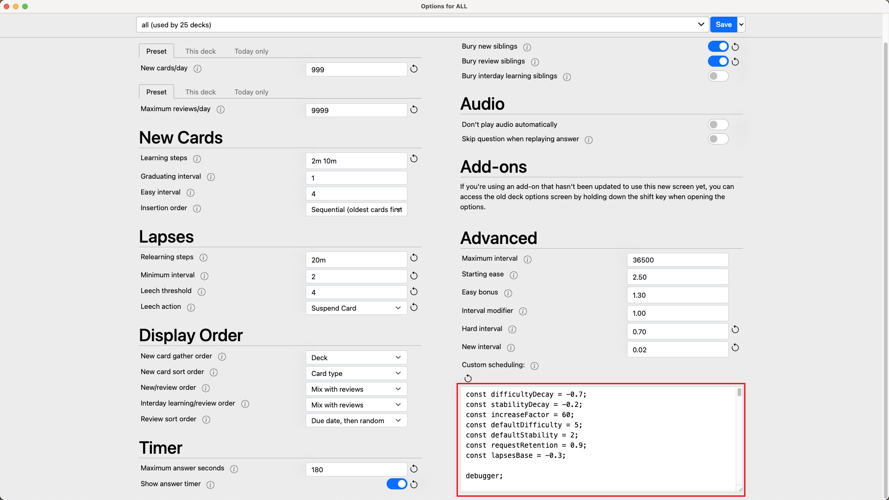

# FSRS4Anki

FSRS4Anki is an Anki [custom scheduling](https://faqs.ankiweb.net/the-2021-scheduler.html#add-ons-and-custom-scheduling) implementing the [Free Spaced Repetition Scheduler algorithm](https://github.com/open-spaced-repetition/free-spaced-repetition-scheduler). FSRS4Anki consists of two parts: scheduler and optimizer.

The scheduler is based on a variant of the DSR (Difficulty, Stability, Retrievability) model, which is used to predict memory states. The scheduler aims to achieve the requested retention for each card and each review.

The optimizer applies *Maximum Likelihood Estimation* and *Backpropagation Through Time* to estimate the stability of memory and learn the laws of memory from time-series review logs.

For more detail on the mechanism of the FSRS algorithm, please see the paper: [A Stochastic Shortest Path Algorithm for Optimizing Spaced Repetition Scheduling | Proceedings of the 28th ACM SIGKDD Conference on Knowledge Discovery and Data Mining](https://www.maimemo.com/paper/).

## Usage

### Scheduling

Please copy the code in [fsrs4anki_scheduler.js](fsrs4anki_scheduler.js), paste it into the bottom of the deck options screen (need to enable the scheduler v3 in Preferences), and save the options. Then it starts to work.

> Remember to use the dev version of Anki because the customData feature was implemented in Anki 2.1.55, which has not been released yet.

### Optimization

The default parameters of FSRS4Anki are trained from my review logs. If you want the algorithm more adaptive to yourself, please follow the guide in [fsrs4anki_optimizer.ipynb](fsrs4anki_optimizer.ipynb) to optimize the parameters from your review logs. Because the neural network model is hard to port to various platforms, I deploy the optimizer on Google Colab. You need to click the button `Open in Colab` to run it.

## Compatibility

Some add-ons intervene in the scheduling of Anki, which would cause conflict with fsrs4anki. I will test these add-ons. Let me know via issues if I miss any add-ons.

| Add-on                                                       | Is it compatible? | Comment |
| ------------------------------------------------------------ |-------------------| ------- |
| [Auto Ease Factor](https://ankiweb.net/shared/info/1672712021) | in test     |         |
| [Delay siblings](https://ankiweb.net/shared/info/1369579727) | in test           |         |

## FAQ

Q1: Will AnkiDroid kill this (since it still doesn't use v3 scheduling)?

A1: I don't have an Android device, so I don't know how AnkiDroid deals with the `customData` in the card field. At worst, FSRS4Anki could deal with the cards synced from AnkiDroid like the existing cards.

Q2: Would a "dormant" deck not actively being used affect the results?

A2: The cards in the "dormant" deck would have long intervals. So FSRS4Anki will predict you will forget them with a high possibility. If you remember them, FSRS4Anki will give longer intervals.

Q3: Does the algorithm change the way the card ease changes. If I just do good and hard will I be stuck in ease hell.

A3: FSRS4Anki substitutes the card ease with difficulty variable. The lower the difficulty, the higher the factor. It needs more test cases to analyze whether it would be stuck in ease hell.

Q4: How can I see if it's working?

A4: You can use the [AnkiWebView Inspector](https://ankiweb.net/shared/info/31746032) add-on. Open the inspector before you review the cards. Then you will get into debug mode and see the custom scheduling code in the inspector.

Q5: Does it work on existing cards, using their past review history? Or does it only work with information that is yet to be created in the future?

A5: It can work on existing cards, but not use their past review history. The interval of cards is converted to the stability of memory, and the factor is transformed to the difficulty.

Q6: Once I started using this fsrs algorithm on my existing deck, if I ever have to go back to using Anki's built in algorithm for the same deck, would that still be possible?

A6: The ease factor is modified by v3 scheduler as usual, and fsrs doesn’t interfere it. Fsrs only modifies the interval of card. So you can go back without any problem.

Q7: Once FSRS is running, which Anki settings will become irrelevant (in the sense that changing them won't affect scheduling anymore) and which won't?

A7: FSRS only modifies the long-term scheduling. So `Learning steps` and `relearning steps` work as usual. 

In the latest version of FSRS4Anki, `maximum interval`,  `easy bonus` and `hard interval` have been supported. You need to modify them in  [fsrs4anki_scheduler.js](fsrs4anki_scheduler.js). 

The `graduating interval`, `easy interval`, `new interval`, `starting ease,` and `interval modifier` become irrelevant. The `requestRetention` of FSRS4Anki is equivalent to `interval modifier`.
